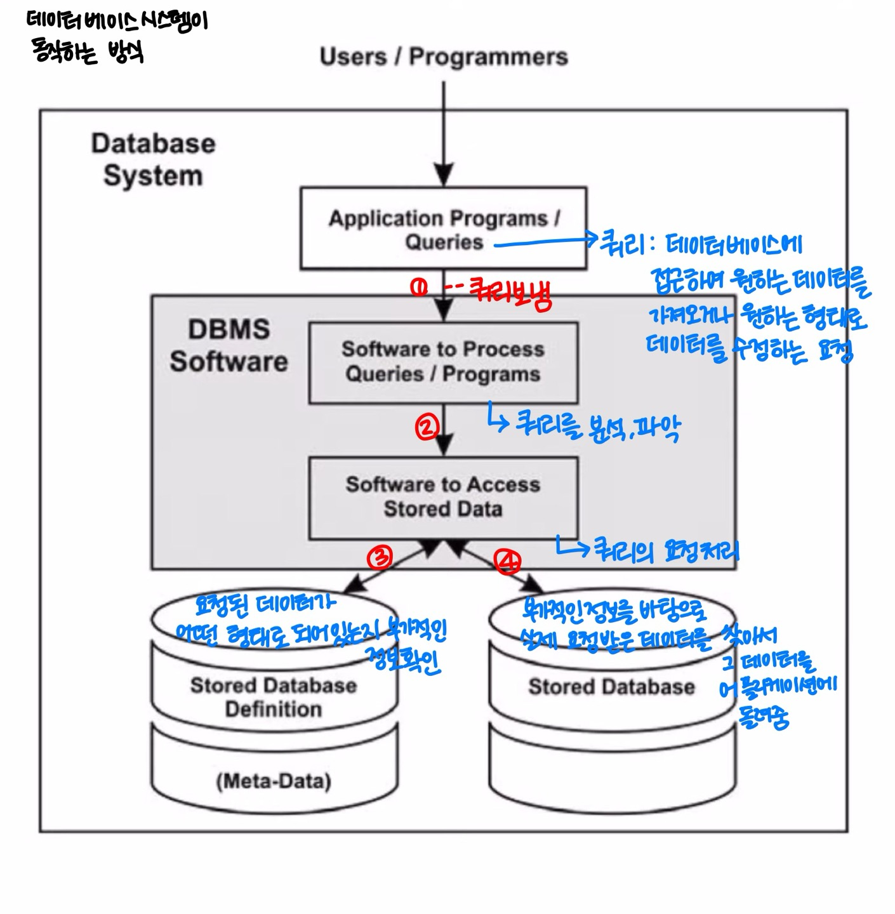

# 1주차

## <데이터베이스 개론>

### 📌 DB & DBMS & Database System의 개념

**1) Database**

전자적으로 저장되고 사용되는 관련 있는 데이터들의 조직화된 집합

(같은 출처, 같은 목적, 같은 서비스 안에서 생성된 데이터들)

**2) DBMS (Database Management System)**

사용자에게 DB를 정의하고, 만들고, 관리하는 기능을 제공하는 소프트웨어 시스템

예: PostgreSQL, MySQL

→ DB를 정의하다 보면 부가적인 데이터, 즉 **metadata**가 발생함

- **Metadata**: 데이터를 정의하거나 기술하는 데이터 (data about data)
    
    예: 데이터 유형, 구조, 제약 조건, 보안, 저장, 인덱스, 사용자 그룹 등
    
    → metadata 또한 DBMS를 통해 저장/관리됨
    

**3) Database System**

Database + DBMS + 연관된 Applications

→ 문맥에 따라 database system을 줄여서 database라고 부르기도 함

→ 문맥에 따라 구분 필요

---

### 📌 Data Models

**1) 개념**

- 데이터베이스의 구조를 기술하는 데 사용될 수 있는 개념들의 집합
- 이러한 개념을 바탕으로 DB 구조를 추상화해서 표현할 수 있는 수단 제공
- DB에서 데이터를 읽고 쓰기 위한 기본 동작들도 포함됨
    
    (예: 데이터 유형, 데이터 관계, 제약사항 등)
    

**2) 분류**

- **Conceptual (or High-Level) Data Models**

: 일반 사용자가 쉽게 이해할 수 있는 수준의 모델

→ 추상화 수준이 가장 높음

→ 비즈니스 요구 사항을 추상화하여 기술할 때 사용

→ 대표적 예: Entity-Relationship Model

- **Logical (or Representational) Data Models**

: 특정 DBMS나 저장 방식에 종속되지 않는 수준에서 구조화할 수 있는 모델

→ 이해하기 쉬우면서도 디테일한 구조화 가능

→ 실제 저장 구조와 크게 다르지 않음

→ 대표적 예: Relational Data Model

- **Physical (or Low-Level) Data Models**

: 데이터가 컴퓨터에 어떻게 파일 형태로 저장되는지를 표현

→ Data Format, Data Ordering, Access Path 등

→ 실제 저장 구조와 밀접하게 모델링

→ 예: Index (데이터 검색을 빠르게 하기 위한 구조체)

---

### 📌 Schema & State

**1) Database Schema**

- Data Model을 바탕으로 데이터베이스 구조를 기술한 것
- 설계 단계에서 정해지며, 한번 정해지면 자주 바뀌지 않음

**2) Database State (Snapshot)**

- 특정 시점의 데이터베이스에 저장된 데이터
- 또는 현재 데이터베이스에 있는 인스턴스들의 집합
- 시간에 따라 데이터는 자주 바뀔 수 있음

**3) Three-Schema Architecture**

→ 데이터베이스 시스템을 설계할 때 사용하는 아키텍처

→ 각 레벨을 독립시켜서, 어느 한쪽의 변화가 다른 쪽에 영향을 주지 않도록 함

→ 사용자 애플리케이션으로부터 물리적인 데이터 저장 구조를 분리하는 목적

- 각각의 레벨마다 **Schema**가 존재
- 실제 데이터는 **Internal Level**에만 존재

- **Internal Schema**

: 물리적으로 데이터가 어떻게 저장되는지를 표현

→ Physical Data Model 사용

→ Data Storage, Structure, Access Path 등 실체가 있는 내용 포함

- **Conceptual Schema**

: 전체 데이터베이스의 논리적 구조를 기술

→ 물리적 저장 구조는 숨김

→ Entities, Data Types, Relationships, User Operations, Constraints 등을 표현

→ Logical Data Model 사용

- **External Schema (External Views, User Views)**

: 사용자 별로 필요한 데이터만 표현

→ 불필요한 정보는 숨김

→ Logical Data Model 사용

---

### 📌 Database Language

**1) Data Definition Language (DDL)**

- Conceptual Schema를 정의하기 위해 사용되는 언어
- 경우에 따라 Internal Schema까지 정의 가능

**2) Storage Definition Language (SDL)**

- Internal Schema를 정의하는 데 사용
- 현대의 Relational DBMS에서는 거의 사용되지 않고, 설정 파라미터 등으로 대체됨

**3) View Definition Language (VDL)**

- External Schema를 정의하기 위한 언어
- 대부분의 DBMS는 DDL이 이 역할까지 수행

**4) Data Manipulation Language (DML)**

- DB의 데이터를 조작하기 위한 언어
    
    → 데이터 추가, 삭제, 수정, 검색 등 기능 포함
    

**5) 통합 언어**

- 현대 DBMS에서는 DDL, VDL, DML이 통합된 형태로 존재
    
    → 대표 예: **SQL (Structured Query Language)**
    

## <관계형 데이터베이스>

## 📘 Relational Data Model

---

### 🔹 용어 정리

- **Set**: 서로 다른 요소들로 구성된 컬렉션 (중복 없음)
    
    → Set 내 요소의 **순서는 중요하지 않음**
    
    → 예: {1, 3, 11, 4}
    

---

### 🔹 1) 수학에서의 Relation

- **Relation**: Cartesian product의 부분집합, 즉 **tuples의 집합**
- **Binary relation**: 두 개의 set A, B에 대해 A × B의 부분집합
- **n-ary relation**: n개의 set에 대한 Cartesian product의 부분집합

---

### 🔹 2) Relational Data Model

**예: STUDENT relation으로 설명**

1. **Domain 정의**
    
    → 학번 집합, 이름 집합, 학년 집합, 전공명 집합, 전화번호 집합 등
    
2. **각 domain에 attribute 부여**
    
    → 예: 학생 전화번호, 비상연락망
    
3. **Tuple로 연결**
    
    → 각 attribute의 값을 연결하여 하나의 튜플을 만듦
    

---

### 🔹 기본 용어

- **Domain**: 더 이상 나눌 수 없는 atomic values의 집합
- **Domain Name**: 각 도메인의 이름
- **Attribute**: 도메인이 relation에서 맡는 역할의 이름
- **Tuple**: 하나의 row로, attribute 값들의 리스트 (NULL 포함 가능)
- **Relation**: 튜플들의 집합
- **Relation Name**: 릴레이션의 이름

---

### 🔹 3) Relation Schema

- Relation의 구조를 나타내는 것으로, **릴레이션 이름과 attributes 리스트**로 구성
- 예: `STUDENT(id, name, major, phone_num, emer_phone_num)`
- Attribute와 관련된 **제약 조건 (constraints)**도 포함됨

---

### 🔹 4) Degree of Relation

- Relation schema에서의 attribute 수
- 예: `STUDENT(id, name, major, phone_num, emer_phone_num)` → Degree는 5

---

## 📘 Relational Database & Schema

---

### 🔹 1) Relational Database

- Relational Data Model을 기반으로 구조화된 데이터베이스
- 하나 이상의 relation으로 구성됨

---

### 🔹 2) Relational Database Schema

- 여러 **relation schemas의 집합 + integrity constraints의 집합**

---

## 📘 Relation의 특징

---

1. Relation은 **중복된 튜플**을 가질 수 없음
2. 튜플을 식별하기 위해 **attribute의 부분 집합을 key**로 설정
3. 튜플의 **순서는 중요하지 않음**
4. Relation 내에서 **attribute 이름은 중복될 수 없음**
5. 하나의 튜플에서 **attribute 순서는 중요하지 않음**
6. Attribute는 **atomic**해야 하며, 복합/다중 값은 허용되지 않음
    
    → 예: "서울특별시 강남구 청담동"은 나누어서 저장해야 함
    

---

## 📘 NULL의 의미

---

- 값이 존재하지 않음
- 값은 존재하지만 아직 알 수 없음
- 해당 사항이 아예 관련 없음

---

## 📘 Keys

---

1. **Super Key**
    - 튜플을 고유하게 식별할 수 있는 attribute들의 집합
2. **Candidate Key**
    - 최소성을 만족하는 super key
    - 어떤 attribute도 제거할 수 없음
    - → **Minimal Super Key**라고도 함
3. **Primary Key**
    - 후보키 중 선택된 주 키
    - 보통 가장 간단하고 짧은 후보키를 선택
4. **Unique Key**
    - Primary key가 아닌 다른 candidate key
    - → **Alternate Key**라고도 부름
5. **Foreign Key**
    - 다른 relation의 **Primary Key를 참조**하는 attribute set

---

## 📘 Constraints (제약 조건)

---

Relational Database에서 항상 지켜져야 하는 조건들

### 🔸 1) Implicit Constraints

- 데이터 모델 자체가 가지는 내재적 제약
    
    예:
    
    - 튜플은 중복될 수 없음
    - 같은 이름의 attribute를 가질 수 없음

### 🔸 2) Schema-based Constraints (Explicit Constraints)

- DDL을 통해 명시적으로 선언하는 제약 조건들
- **Domain Constraint**:
    - 값은 해당 attribute의 domain에 속해야 함
- **Key Constraint**:
    - 서로 다른 튜플이 같은 key 값을 가질 수 없음
- **NULL Value Constraint**:
    - NOT NULL로 명시된 attribute는 NULL을 가질 수 없음
- **Entity Integrity Constraint**:
    - Primary Key는 NULL 값을 가질 수 없음
- **Referential Integrity Constraint**:
    - Foreign Key는 참조하는 Primary Key의 도메인과 같아야 함
    - PK에 없는 값을 FK가 가질 수 없음